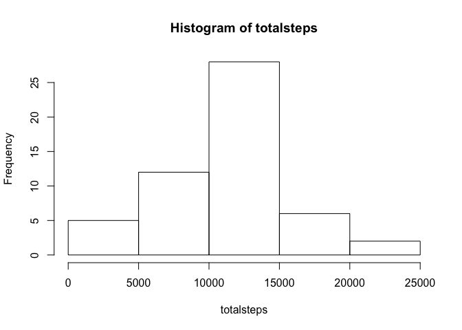
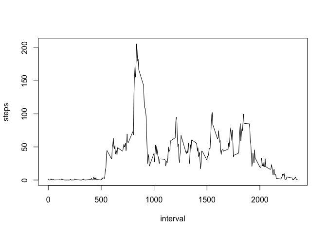
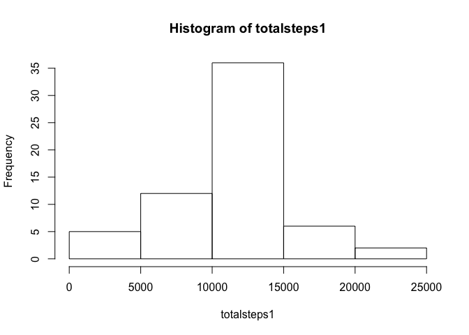

# Reproducible Research: Peer Assessment 1


## Loading and preprocessing the data

### Unzip and read the csv into a data frame

```r
zipfile <- unz("./activity.zip", "activity.csv")
data <- read.csv(zipfile)
```

### Set the options to avoid scientific notation.

```r
options(scipen=3)
```

## What is mean total number of steps taken per day?

### First, total the steps across each date.

```r
totalsteps <- tapply(data$steps, data$date, FUN = sum)
```

### Then produce a histogram showing the results.

```r
hist(totalsteps)
```

<!-- -->

### The mean steps per day is 10766.1886792.

```r
mean(totalsteps, na.rm=T)
```

```
## [1] 10766.19
```

### And the median is 10765.

```r
median(totalsteps, na.rm=T)
```

```
## [1] 10765
```

## What is the average daily activity pattern?

### First, we average the steps across each interval.

```r
timepattern <- aggregate(data$steps, by = list(data$interval), mean, na.rm = T)
colnames(timepattern) <- c("interval", "steps")
```

### This line chart shows the result.

```r
plot(timepattern, type="l")
```

<!-- -->

### The 5-minute interval with the most steps on average is 835, which has 206.1698113 steps.

```r
timepattern[which.max(timepattern$steps),]
```

```
##     interval    steps
## 104      835 206.1698
```

## Imputing missing values

### Some values in the data set are missing. This shows us how many.

```r
sum(is.na(data$steps))
```

```
## [1] 2304
```

### To fix this, we will use the average value for that interval across all days.

```r
data1 <- data
for (i in 1:nrow(data1)) {
    if (is.na(data1$steps[i])) {
        data1$steps[i] <- timepattern[which(timepattern$interval == data1$interval[i]),]$steps
    }
}
```

### To compare this new data set to the original, we will sum them up across dates.

```r
totalsteps1 <- tapply(data1$steps, data1$date, FUN = sum)
```

### The histogram now looks like this.

```r
hist(totalsteps1)
```

<!-- -->

### The mean steps per day is 10766.1886792, which is the same as the original data set (since we used averages to fill in the blanks).

```r
mean(totalsteps1, na.rm=T)
```

```
## [1] 10766.19
```

### The median is now 10766.1886792, which is slightly higher.

```r
median(totalsteps1, na.rm=T)
```

```
## [1] 10766.19
```

## Are there differences in activity patterns between weekdays and weekends?

### We will create a new variable that determines whether a date is a weekend or weekday.

```r
weekends <- c("Saturday", "Sunday")
data1$date <- as.Date(data1$date)
data1$weekday <- factor((weekdays(data1$date) %in% weekends), levels=c(F,T),
    labels=c("weekday", "weekend"))
```

### We will now average the steps by weekend and weekday by interval.

```r
timepattern <- aggregate(data1$steps, by = list(data1$weekday, data1$interval), mean, na.rm = T)
colnames(timepattern) <- c("weekday", "interval", "steps")
```

### Using the lattice plot, we can compare the two line charts.

```r
require(lattice)
```

```
## Loading required package: lattice
```

```r
xyplot(steps ~ interval | weekday, timepattern, type = 'l')
```

<!-- -->

### The weekday step pattern seems to peak in the morning and evening hours with lower activity midday. The weekend pattern remains steadier throughout the day.
